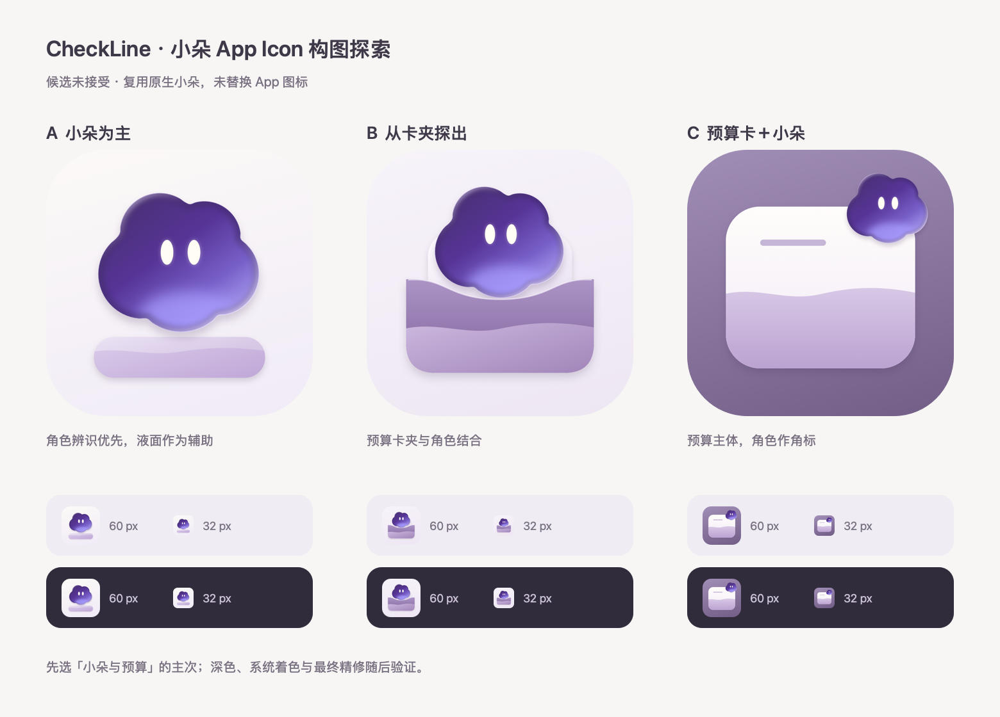

# 小朵 App Icon 构图候选

2026-10-03，Rex 已接受 Hugeicons 功能图标，桌面 App Icon 继续讨论。本目录只用于比较角色与预算的主次。Rex 随后明确不满意本组三个 App Icon，**第一轮不采用，也未替换 AppIcon 资源**。继续比较 [第二轮：小朵特写／液位小朵／云形标志](round-2/README.md)，新候选仍待确认。



- **A 小朵为主（优先讨论）**：放大小朵，预算液面是底部辅助。角色与 App 内的 Agent 一致，小尺寸仍能辨认双眼；预算含义需要继续精修，底部托盘不是新产品能力。
- **B 从卡夹探出**：卡夹与小朵形成一个轮廓，更直接对应首页预算卡夹。元素与边缘层次更多，小尺寸要检查是否过密。
- **C 预算卡＋小朵**：保留液位预算卡主体，小朵作右上角标。预算含义更明确，32 px 下角色细节较弱。

可先确认 A / B / C 的主次关系或组合，随后细化比例、底部液面、深色及系统着色。当前只完成静态构图比较；没有验证系统实际裁切、设备主屏识别度或最终品牌体验。

## 渲染事实

三个 1024 × 1024 候选均为不透明正方形。对照板只在预览时加外圆角，并在浅、深两种桌面底色上显示 60 / 32 px 的同一候选；这两种底色**不是已完成的深色 App Icon 资产**。小朵由正式 App 的 `CloudMascotDrawing` 和 `CloudMascotMotion` 渲染，沿用已有轮廓、紫色云壳及奶白双眼，没有引入新 IP。

在仓库根目录执行（只写本探索目录）：

```sh
python3 - <<'PY'
from pathlib import Path
source = Path('Check_Line/DesignSystem/CloudMascotView.swift').read_text()
Path('/tmp/checkline-icon-mascot-drawing.swift').write_text(
    'import SwiftUI\n' + source[source.index('struct CloudMascotDrawing: View'):]
)
PY
swiftc Check_Line/DesignSystem/CloudMascotMotion.swift \
  /tmp/checkline-icon-mascot-drawing.swift \
  docs/design/explorations/app-icon-mascot/render.swift \
  -o /tmp/checkline-icon-mascot-render
/tmp/checkline-icon-mascot-render
```

脚本导出 `a-mascot.png`、`b-pocket.png`、`c-card.png` 与 `mascot-icon-comparison.png`；不会写 `Assets.xcassets/AppIcon.appiconset`。
