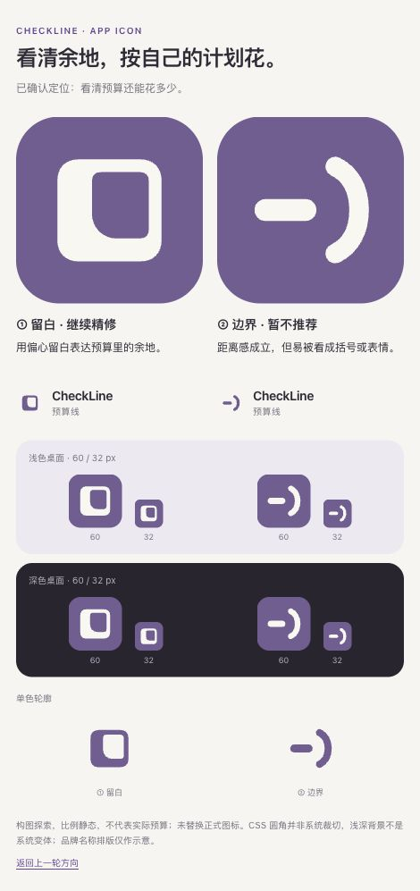

# CheckLine App Icon · 预算余地

2026-10-03。Rex 确认第一价值为看清预算还能花多少、心愿为第二层动力；桌面 App Icon 不考虑吉祥物。此决定不移除 App 内的小朵。已先同步现有产品与设计文档，再进行本轮原创矢量构图。

[打开两个方向](index.html) · [沿用的官方案例与方法](../round-4/research.md)

| 方向 | 形状语法 | 设计推断与待判断 |
| --- | --- | --- |
| ① 留白 | 紧凑的完整边界，左下较厚的实体与偏向右上的负空间 | 建议继续精修；偏心内孔与大弧左下角减少普通 O 的联想，仍需要检验轮廓辨识和预算含义 |
| ② 边界 | 一段短线与一条温和的弧形边界，保留二者之间的距离 | 实际渲染容易读成括号、表情或方向符号，本轮暂不推荐；保留作比较，不作为后续要求 |

两者比较的是面积与距离两种语法，不是仅换颜色。轮廓与所用颜色均为待选择的候选值，主体不使用字母助记、勾、小朵、货币、储蓄罐、液体、数字或刻度；心愿不再加第二个符号。

`a-space.svg`、`b-boundary.svg` 为有不透明背景的 1024 × 1024 SVG 构图；`a-mark.svg`、`b-mark.svg` 是同一轮廓的深紫单色透明底版本。均为直接绘制的原创路径，没有调用图像生成或第三方素材。画布不预裁圆角，预览由 CSS 遮罩展示。

图标只表达产品心智，不显示真实用户余额、进度或数据覆盖。单个图形无法保证陌生人立即理解预算，名称、独特轮廓和使用体验需共同建立识别。研究来自已实际核验的上一轮来源，不因本轮颜色和轮廓假设扩大其证据结论。

当前两个构图尚未采用，不替换正式 AppIcon。后续选定并精修后才制作系统外观、分层与低版本兼容资源，检查原生裁切和真机主屏。本轮没有 App 代码、金额或账本变更，不运行业务或 UI 测试。实际浏览器在 470 px 视口检查：14 个图片引用均加载，页面没有横向溢出；60 / 32 px 缩略的实际 CSS 尺寸正确，控制台未出现错误或警告。已检查浅深背景与单色轮廓，截图见下方。这里未验证原生主屏、系统图标外观或真机识别度。

内部初稿曾使用左上切口与底部连线。实际渲染后出现鞋形与进度控件联想，因此在交付前改成完整边界与单弧边界；初稿未采用，不作为后续要求。

独立视觉复核认为前一版完整边界仍像普通 O，单弧边界像文本表情。本版缩小并向右上偏置留白，扩大左下内弧，保留至少 70 / 1024 的上、右薄边（32 px 下约 2.2 px）。这是标记的构图探索，尚非成熟品牌资产。

