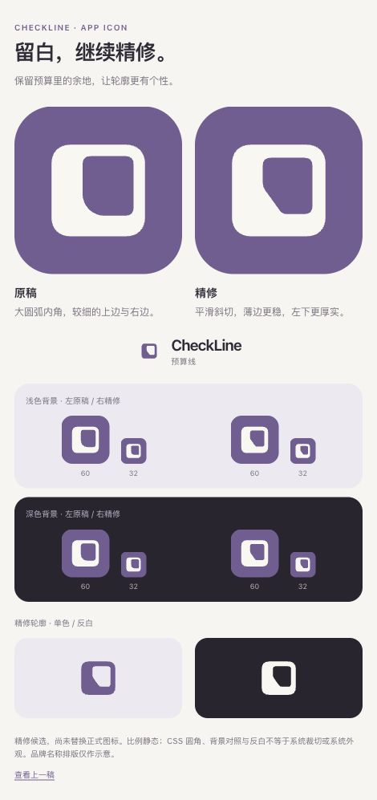

# CheckLine · 留白方向精修

2026-10-03。Rex 选择继续精修第五轮左侧留白方向；预算余量仍是第一价值，心愿仍是第二层动力。本轮仅精修品牌标记，不扩展产品功能，不改 App 内小朵或已确认功能图标。先记录方向，再制作可见候选。

[打开原稿与精修对照](index.html) · [第五轮构图](../round-5/README.md)

## 本轮变化

- 保留封闭软方形外轮廓、右上偏心留白、左下较厚实体与原配色。
- 把内孔左下的大圆弧改成有平滑过渡的斜切，检验能否减少普通 O / 空白窗口联想，给厚实体更清楚的方向感。
- 上、右薄边由 70 调整为 80 / 1024 单位；在 32 CSS px 的对照中，几何宽度约 2.5 px（原稿约 2.19 px）。增加余量用于本轮候选比较，不是平台规范或已接受 Token。
- 内孔略收，底边由约 126 加厚到 136 单位；视觉重心和抗锯齿效果以实际渲染为准。

这是在已选择的留白方向内精修，不重新讨论括号方向，也不通过添加勾、角标、吉祥物或解释文字补足辨识。颜色沿用第五轮候选的紫色 `#725D93` 与奶白 `#FAF7F1`，不把配色改变混入轮廓判断。

## 资源与边界

`before-icon.svg` / `before-mark.svg` 是第五轮左侧的原稿快照。`refined-icon.svg` 是 1024 × 1024 不透明正方形；`refined-mark.svg` 和 `refined-mark-reversed.svg` 是同一轮廓的单色透明底版本。所有候选直接绘制矢量路径，没有第三方图形、生成位图、外部依赖或脚本动画；画布未预裁圆角。

预览把原稿和精修并列，比较浅深底色上的 60 / 32 px、单色与反白轮廓。这里的浅深背景不是系统 App Icon 外观；CSS 遮罩不是原生裁切。比例静态，不代表用户实际预算。

方向已选择，精修图形与正式资源尚待 Rex 看图确认。仍可能联想到斜切窗口或框形字母 D；单个标记不能保证陌生人立即理解预算，名称与使用体验仍需共同建立含义。正式 AppIcon 尚未替换，不声称完成商标相似度检索、Icon Composer、模拟器或真机主屏验证。本轮仅文档与矢量探索，不运行业务回归或原生 UI 测试。

## 渲染检查

实际浏览器在 470 px 视口完成检查：13 个图片引用均加载，页面没有横向溢出；60 / 32 px 缩略的实际 CSS 尺寸正确，控制台没有错误或警告。已保存下方浏览器截图，并由独立视觉复核确认上、右薄边在 32 px 下连续，未发现断边或对话框尾巴。两种背景与单色反白只验证本轮静态构图；原生设备、系统图标外观与品牌偏好仍未验证。

