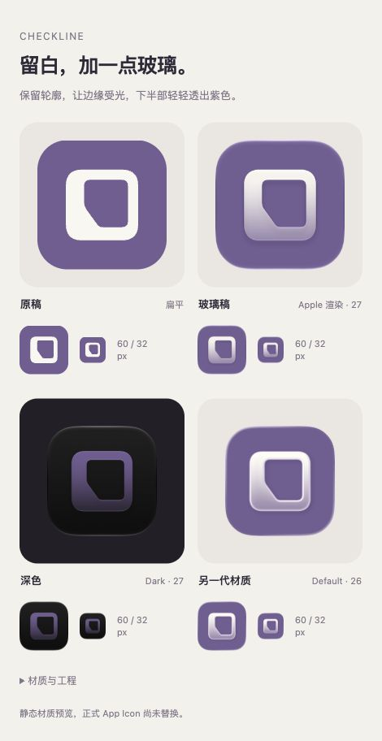

# CheckLine · Icon Composer 玻璃材质

2026-10-03。Rex 暂时保留轻量留白轮廓，要求使用已安装的 Apple 工具增加一点玻璃质感。本轮只做可编辑材质工程和官方渲染对照，正式 App Icon 尚未替换。

[打开对照](index.html) · [可编辑工程](CheckLine-Glass.icon) · [上一轮轮廓](../README.md)

## 来源与制作

- 本机工具为 Apple **Icon Composer 27.0 (129)**，安装在 `/Applications/Xcode.app/Contents/Applications/Icon Composer.app`。官方说明：[Icon Composer](https://developer.apple.com/icon-composer/)、[Xcode 使用说明](https://developer.apple.com/documentation/xcode/creating-your-app-icon-using-icon-composer)、[WWDC25 工作流](https://developer.apple.com/videos/play/wwdc2025/361/)。核对日期为 2026-10-03。
- `mark.svg` 与 `../lighter-mark-reversed.svg` 字节一致；透明底奶白前景只包含既有矢量路径，没有烘焙高光、阴影、圆角遮罩或玻璃背景。`CheckLine-Glass.icon/Assets/mark.svg` 是同一资产。
- 在原生 Icon Composer 中新建文档，实际导入 SVG 为一个图层、一个组；开启的 Liquid Glass 由工具处理。GUI 导入后生成的原生自动保存工程包含 `icon.json` 与前景资产。只恢复本轮文档，并先核对资产字节，未读取其他工程。
- 颜色面板与保存菜单的自动化访问发生阻塞，之后复制本轮原生自动保存工程为 `CheckLine-Glass.icon`，按已观察到的原生 `fill.solid` 字段将 Azure 改为既有紫色 `#725D93`。预览通过同一应用内置的 `ictool` 实际导出；没有用网页滤镜或手工位图模拟官方玻璃。
- 原生初始组参数为 `neutral` 阴影 0.5、启用透光 0.3。本轮比较 0.3 与 0.65 后，把候选工程透光值设为 0.65，使下半部透出更多紫色，保留较亮上缘。此值为探索参数，不是已接受的材质 Token。背景颜色、几何、图层与阴影类型未改变。

## 资源与复现

| 文件 | 实际导出设置 |
| --- | --- |
| `default-27.png` | iOS / Default / 27，透光 0.65 |
| `dark-27.png` | iOS / Dark / 27，透光 0.65 |
| `default-26.png` | iOS / Default / 26，透光 0.65 |
| `frosted-27.png` | iOS / Default / 27，透光 0.30，初始磨砂比较 |

以上均为 1024 × 1024 PNG，由官方渲染器生成外缘和材质。小尺寸对照使用这些完整导出图，原稿的 CSS 圆角只用于说明扁平稿；未给官方 PNG 再加遮罩。

在仓库根目录执行以下命令可重做主要预览；切换 `--rendition Dark` 或 `--design-generation 26` 即得到表中对应导出。恢复初始磨砂需要在工程中把组透光值改回 0.3 后导出，再恢复 0.65。

```sh
'/Applications/Xcode.app/Contents/Applications/Icon Composer.app/Contents/Executables/ictool' \
  docs/design/explorations/app-icon-mascot/round-6/glass/CheckLine-Glass.icon \
  --export-image \
  --output-file docs/design/explorations/app-icon-mascot/round-6/glass/default-27.png \
  --platform iOS --rendition Default \
  --width 1024 --height 1024 --scale 1 --design-generation 27
```

## 验证边界

三个主要外观导出及磨砂比较均成功，已直接查看实际图片。明亮边缘、较深的下半部与自动深色配色属于本次观察；设计是否合适仍待 Rex 看图。

实际浏览器在 470 px 视口检查：13 个图片引用全部加载、页面没有横向溢出，原稿、Default 27、Dark 27 与 Default 26 的 60 / 32 px 对照实际尺寸正确，控制台无错误或警告。前景 SVG 与冻结源稿逐字节一致；原生文档可被官方工具读取，四张 PNG 均为 1024 × 1024。独立复核未发现明显几何偏移，Default 27 的 32 px 薄边连续；随后补查 Dark 27 的真实 32 px 对照，轮廓仍闭合但下半部较弱，正式采用前需结合主屏壁纸复验。Default 26 的双层亮边更厚，当前主要候选保持 27 材质。此证据不代表动态系统主屏表现。



`.icon` 保留工具初建时的共享方形 / watchOS 圆形预览声明，这不是给 CheckLine 新增 watchOS Target。工程未接入 Xcode App 资源；未验证模拟器、真机主屏、动态照明、系统 Mono / Tinted 或旧版系统降级。此次没有业务逻辑或原生页面改动，不运行金额业务回归。App 内小朵和已接受的功能图标沿用既有约定。
