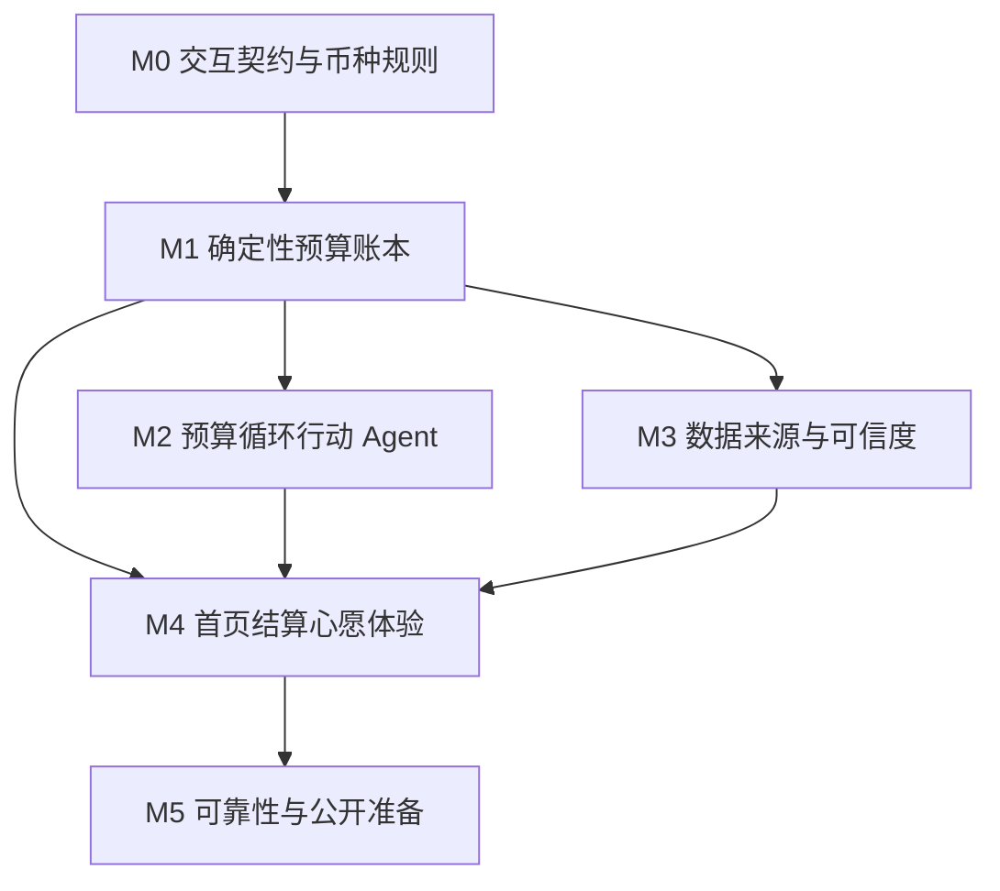

# ROADMAP — CheckLine 产品与交付节奏

> 对真实用户公开的 V1 是完整预算循环；开发过程仍按内部里程碑逐段跑通。内部里程碑不是对外残缺版本。
>
> 切片节奏、依赖门禁和每阶段验收以本文为准。不另建第三份流程文档。

---

## 一、当前状态

### 已完成：产品核心逻辑收敛

- 预算卡是用户自己设定的消费边界；
- 一笔消费只影响一张结算预算卡，可带多个标签；
- Agent 是预算循环行动 Agent，不是泛财务助手；
- Apple Pay、短信、邮箱是可跳过的 V1 被动入口，账单导入负责兜底；
- 循环预算、一次性预算、下周期队列和主动结算规则已闭合；
- 结余、越线、唯一心愿钱包、待恢复差额和心愿兑现规则已闭合；
- 迟到交易与退款使用追溯原周期的确认式修正；
- 首次引导与首页“预算状态 + 常驻 Agent + 底部任务面板”框架已确认；
- 财务健康分、收入债务画像和完整财务规划已从范围删除。

### 当前进行中：M0 交互形态收敛

下一刀（按依赖，可并行文档，不可跳过钱包币种门禁）：

1. 首页多卡信息层级与固定顺序；
2. 主导航：记录 / 心愿 / 设置入口（不定死旧四 Tab）；
3. Agent 底部任务面板状态、反馈、全屏升级条件；
4. 结算检查页与心愿兑现确认页必须展示的金额影响；
5. 唯一钱包基准币、换算时点、汇率来源（**进入 M1 钱包账本的硬门禁**）。

M0 产出是 `DESIGN.md` 已确认交互契约和必要探索稿，不是可发布 UI。现有启动页仍指向 `Features/Prototype` 旧样机，直到 M4 替换。不在旧四 Tab、多预算重复扣减模型上继续加功能。

---

## 二、V1 对外范围

公开 V1 必须形成完整闭环：

```text
创建预算卡
→ 多入口记录消费
→ 查看已用、剩余和数据覆盖
→ 检查并主动结算
→ 结余 / 越线影响唯一心愿钱包
→ 按真实购买兑现心愿
→ 追溯处理迟到交易和退款
```

V1 同时包含：

- 文字、语音、图片统一 Agent；
- Apple Pay、银行短信、邮件三类可选被动入口；
- 近期账单导入；
- 标准化、跨来源去重、低置信确认和纠正规则学习；
- 循环/一次性预算卡；
- 唯一心愿钱包与心愿清单；
- 多币种、设备优先隐私和来源覆盖提示。

不把“所有地区银行自动连接”作为 V1 门槛。通用导入保证基本可用，自动连接按系统和地区能力实现。

---

## 三、开发流程

每个实现切片都走同一条路径，不按里程碑整包开工。一次只交付一个可测能力，例如「下周期队列」或「结算事务提交」。

```text
确认循环（FEATURE-LOOP）
  → 先改对应权威文档
  → Core 服务 + Swift Testing
  → 仅实现本切片需要的 Application / UI / Capture
  → 中英文本地化与隐私边界
  → 更新本文「实际产出」
```

文档先行规则：

- 金额 / Schema / 关系：先改 `docs/engineering/ARCHITECTURE.md`，再写代码。
- 页面 / 文案：先改 `docs/design/DESIGN.md`。
- 权限 / 数据流：先改 `docs/engineering/PERMISSIONS.md` 与 `docs/compliance/PRIVACY.md`。
- 产品范围变化：先改根目录 `PRODUCT.md`，再同步 PRD、功能循环、术语和本文。

工程硬约束：

- 金额只用 `Decimal`；预算剩余、结算、钱包余额和待恢复差额全部派生，不持久化会漂移的字段。
- 不为尚未开工的模块空建目录。
- 不把 `Features/Prototype` 的多预算关系、四 Tab、悬浮「文本/语音」入口或旧结算当作新需求。
- Agent 不得直接写数据库，必须经 Application / Core；高影响动作走 `ConfirmationGate`。
- 所有用户可见字符串同步维护 `zh-Hans` 与 `en`。

切片完成时：文档、产品行为和实现一致；金额逻辑有可复验测试；未覆盖能力和地区限制被明确说明。

---

## 四、依赖与阶段门禁



M2 与 M3 都依赖 M1，彼此不互相阻塞：文字 Agent 与本地账本必须能独立运行；被动来源全部可跳过。M4 把三者收成可日常使用的产品。M5 只验收完整闭环，不补新功能。

| 门禁 | 进入条件 |
|------|----------|
| M0 → M1 | 交互契约已写入 `DESIGN.md`（信息架构、确认页必须出现的字段、Agent 升级条件）；唯一钱包基准币、换算时点、汇率来源已写入 `PRODUCT.md` 与 `ARCHITECTURE.md`。视觉打磨可以留到 M4，但 M1 不得在币种规则未定时生成 `walletSignedAmount`。 |
| M1 → M2 / M3 / M4 | 不依赖 AI 和外部来源，测试能完整跑通一个循环预算和一个一次性预算，含结算、钱包、待恢复差额、心愿兑现、迟到交易和退款。 |
| M4 → M5 | 首页、结算、心愿、来源覆盖在真实页面和目标视口可走通；`CheckLineApp` 不再启动 `CheckLinePrototypeView`。 |
| M5 完成 | 二进制行为与隐私说明一致，降级路径可演示，金额回归全绿。 |

---

## 五、内部里程碑

### M0 · 文档与交互原型

**目标**：让产品定义、金额规则和关键交互一致，再进入正式模型开发。

**已完成**

- [x] 收敛核心产品逻辑；
- [x] 更新产品宪法、PRD、功能循环、术语和架构。

**剩余切片**

1. 首页多张预算卡的信息层级与固定顺序；
2. 主导航，以及记录 / 心愿 / 设置入口（不定死旧四 Tab）；
3. Agent 底部任务面板的状态、反馈和全屏升级条件；
4. 结算检查页与心愿兑现确认页必须展示的金额影响；
5. 唯一心愿钱包的基准币、换算时点与汇率来源（进入 M1 钱包账本的硬门禁）；
6. 用真实内容核对关键状态和目标视口；
7. 将旧原型明确降为历史参考；不在 `Features/Prototype` 的多预算模型上继续加功能。

**验收**

- `DESIGN.md` 已确认交互契约可指导后续实现，而不是停留在原则层；
- 钱包跨币种规则已写入产品宪法和架构，足以让 M1 生成或明确拒绝 `walletSignedAmount`；
- 旧样机不再出现在当前需求入口。

**本阶段不做**

- 正式 SwiftData Schema、领域服务重写、可发布 UI；
- 在旧四 Tab 样机上叠加新 V1 功能。

---

### M1 · 确定性预算账本

**目标**：先跑通所有金额都可验证的本地闭环。实现按依赖顺序，不先做正式 UI。

**工程切片**

1. SwiftData `VersionedSchema`：`Budget` / `BudgetPeriod` / `Expense` / `ExpenseTag`（一笔消费最多一个结算周期）；
2. 重写 `BudgetEngine`：已用、剩余、进度，以及待确认金额单独计算；用唯一预算归属测试替换 `PrototypeDeletionTests`；
3. `CycleEngine`：循环 / 一次性、待结算、下周期队列；
4. `AttributionEngine`：唯一归属、未纳入、待确认；
5. `CurrencyEngine`：原币 → 暂估 → 入账；按 M0 已确认规则写入钱包换算；
6. 手动记一笔的 Application 写入路径（无 Agent）；
7. `SettlementEngine`：覆盖检查 + 单一事务提交（Settlement、钱包分录、周期状态、队列迁移或归档一起提交或一起回滚）；
8. `WalletLedger`：结余先补待恢复差额，越线先扣钱包；
9. `WishRedemptionEngine` 与 `RetrospectiveAdjustmentEngine`。

**验收**

- Swift Testing 覆盖 `BudgetEngine`、`CycleEngine`、`AttributionEngine`、`SettlementEngine`、`WalletLedger`、`WishRedemptionEngine`、`RetrospectiveAdjustmentEngine`，以及本阶段已落地的 `CurrencyEngine` 与 SwiftData 关系 / 删除；
- 不依赖 AI 和外部来源，同一币种能完整跑通一个循环预算和一个一次性预算。

**本阶段不做**

- 行动 Agent、系统权限、网络、被动数据来源、正式首页与主导航。

---

### M2 · 预算循环行动 Agent

**目标**：让文字、语音和图片共用同一套行动与风险门禁。

**工程切片**

1. `AgentActionCoordinator`、`ConfirmationGate`、`UndoCoordinator`；
2. 文字 Capture → 标准化候选，再调用 Core；LLM 不计算余额；
3. 信息明确的低风险单笔：直接执行并立即提供撤销；
4. 归属不确定或图片包含多笔：先确认结构化结果；
5. 调额度、改周期、删除、批量修改、结算、钱包变化和追溯：先展示金额影响；
6. 语音与图片适配器：首次使用才申请权限，拒绝后回退文字。

**验收**

- 文字、语音、图片进入同一套结构化行动，不拆成多个产品入口；
- Agent 只调用确定性领域服务，不自行生成余额、结余或钱包数字；
- AI 不可用时，手动结构化记录仍能工作。

**本阶段说明**

- 可以有能跑通门禁的任务面板；首页视觉与主导航定稿仍归 M4。

**本阶段不做**

- 正式首页信息层级、被动数据来源连接器、按消费记录主动推荐购买。

---

### M3 · 数据来源与可信度

**目标**：降低记录成本，同时诚实表达覆盖范围。先做平台风险最低、也能单独降级的入口。

**工程切片**

1. `DeduplicationEngine`、`SourceEvidence`、`DataSourceConnection`（覆盖时间、缺口说明、可断开）；
2. 近期账单文件导入（通用兜底）；
3. Apple Pay 系统自动化；
4. 银行短信系统自动化与模板；
5. 邮件账单 / 小票（若需中转，先更新隐私文档再接入）。

**验收**

- 高度一致的重复记录自动合并并保留来源证据；无法确定时再询问用户；
- 设置页可跳过、断开和之后补连；
- 任一来源失败不得阻断手动记录和本地账本。

**本阶段不做**

- 宣称全渠道或全球银行「安装后自动同步」；
- 偷读其他 App 通知、模拟登录支付或银行账号。

---

### M4 · 首页、结算与心愿体验

**目标**：按 M0 契约把 M1–M3 收成可日常使用的产品，并替换启动页。

**工程切片**

1. App 壳与主导航；
2. 首页：顶部处理区、固定顺序预算卡、常驻 Agent；
3. 检查式结算、钱包变化与待恢复差额反馈；
4. 心愿清单、真实购买确认、退款状态；
5. 数据来源设置（跳过 / 断开 / 补连）；
6. 最短引导：先创建预算卡，心愿和来源可跳过；
7. 无障碍、Dynamic Type、中英、目标视口真实页面验收；
8. `CheckLineApp` 不再启动 `CheckLinePrototypeView`。

**验收**

- 用户能在真实页面完成「创建预算卡 → 记一笔 → 查看已用/剩余/覆盖 → 结算 → 心愿兑现」；
- 待确认金额只触发「可能」风险，不能形成确定越线结论；
- 核心任务在不同设备、文字缩放、VoiceOver 和减少动态效果下完整可用。

**本阶段不做**

- 新的金额规则或新的数据来源类型；
- 把旧四 Tab 样机当作定案导航。

---

### M5 · V1 可靠性与公开准备

**目标**：完成正式首发前的准确性、隐私和降级验证。只做回归、降级、隐私和发布材料，不扩范围。

**工程切片**

1. 迟到交易、退款、重复来源和汇率入账差异回归；
2. 权限拒绝、来源断连、离线和 AI 不可用降级；
3. 数据导出 / 删除与隐私说明，必须匹配真实二进制；
4. 性能、崩溃和金额精度检查；
5. App Store 文案、截图、定价和发布准备。

**验收**

- 金额回归全绿；
- 降级路径可演示：文字 Agent 与本地账本在无网络、无权限、无被动来源时仍可用；
- App Store 申报只依据待提交二进制的真实行为。

**本阶段不做**

- 商业化范围扩张、macOS Target、Widget 或其他 V1 之后能力。

---

## 六、V1 之后

只有在核心循环真实运行后再评估：

- 更多国家/地区银行聚合连接；
- Widget、Lock Screen、Action Button、Siri 等快捷入口扩展；
- macOS 菜单栏和全局快捷键；
- 更丰富的结算与心愿视觉反馈；
- 商业化和付费能力。

不因为接入更多数据而扩张到投资、贷款、税务、保险或泛化财务健康评分。

---

## 七、阶段完成标准

每个里程碑都必须：

1. 文档、产品行为和实现一致；
2. 金额逻辑有可复验测试；
3. 用户改动和其他未提交工作不被覆盖；
4. UI 改动在真实页面和目标视口验收；
5. 未覆盖能力和地区限制被明确说明。

阶段结束时在本文附录记录实际产出。未满足对应门禁，不得开始下一里程碑的正式实现。

---

## 附录 · 决策记录

- 2026-07-06：旧版本收敛为浅色预算钱包原型，心愿后置。
- 2026-08-10：重新收束产品。删除泛财务健康方向，确认“预算卡 → 多入口记录 → 主动结算 → 唯一心愿钱包 → 真实购买兑现”的完整核心循环；旧版多预算重复扣减和心愿分配规则废弃。
- 2026-09-01：保留 M0–M5 编号和目标，把开发流程、依赖门禁、工程切片和验收标准写入本文，作为后续实施的唯一节奏来源。

---

## 附录 · 实际产出

> 2026-08-10 之前的记录保留为历史事实；其中旧产品规则不再作为当前实现依据。

- 2026-07-06：文档方向收敛到旧「预算钱包」浅色卡片主参考；心愿系统移动到第三轮。
- 2026-07-20：旧 Swift Package 项目迁入正式 Xcode iOS App 工程；保留产品文档、HTML/SwiftUI 原型与 Git 历史，最低系统版本对齐 iOS 17。现有 SwiftUI 页面用于迁移后体验验证，不代表当前 MVP 范围已正式实现。
- 2026-07-20：文档重组为 `product / design / engineering / compliance / archive` 五层；移除重复模块说明，架构、术语、权限和隐私统一到第一轮本地 MVP。
- 2026-07-20：HTML 原型已迁为可运行的原生 SwiftUI 体验样机，完成四 Tab、预算钱包横滑、记一笔、统计日历和结算主流程的模拟器验证；样机仍使用内存示例数据，正式 SwiftData MVP 尚未开始。
- 2026-07-20：样机交互控件进一步原生化；记一笔、结算、设置和预算列表改用 SwiftUI `Form` / `List` / `Section` / `Picker` / `ProgressView`，保留预算卡和图表等品牌展示组件，并完成 iOS 17.5 模拟器回归验证。
- 2026-07-20：根据阶段调整，进一步收敛为 native-first；首页、预算详情、统计和日历改用系统 `List`、分页 `TabView`、Apple `Charts` 和图形 `DatePicker`，撤掉自定义卡片、Toast、悬浮按钮、胶囊选择器和自绘日历包装，最终视觉表现后置。
- 2026-07-20：纠正首页原生化过度导致的信息拆散；恢复钱包横滑、当前钱包摘要与分类/记录的连续工作区，继续使用原生 SwiftUI 滚动与分页能力，但不再用 `List Section` 强行拆分复合交互。
- 2026-07-25：进入正式 MVP 实装，建立 `Check_LineTests` Swift Testing Target，并完成 `BudgetEngine` 首批纯 Swift 规则：汇总有效关联金额、保留真实负结余、派生日常可花金额与超出金额、限制界面进度；5 个边界测试通过。样机 UI 尚未接入该服务，SwiftData 仍未开始。
- 2026-07-26：收敛预算与消费删除规则，并在 SwiftUI 体验样机完成预算删除、记录单独/批量删除、共享消费逐笔全局删除选择和普通记录撤销；4 个关系删除测试通过。当前仍为内存样机验证，正式 SwiftData 删除关系与回收站均未实现。
- 2026-07-28：重新收敛前端设计治理方式；设计文档区分产品原则、体验底线、当前方案与探索参考，取消将 Apple HIG、系统默认控件、固定字号、44pt 视觉尺寸、红黄绿状态色和浅色钱包方案视为永久设计强规则。SwiftUI 原生能力调整为有前提的工程选择，视觉与品牌最终由真实界面验收。
- 2026-08-01：先完成首页极简方向的原生验证切片；以核心剩余金额为唯一强焦点，用紧凑预算选择器、三项分级快捷操作和单一最近记录表面替代横滑钱包与多区块堆叠，并补齐中英文、iPhone 小屏、iPad 聚焦阅读宽度和辅助文字重排检查。该阶段当时只确认首页方向，随后由下一条产出继续扩展。
- 2026-08-01：根据后续设计确认，将首页的轻量注意力与表面语言扩展到 8 个核心页面；首页 `+` 改为轻点后围绕主按钮显示「文本 / 语音」，移除长按和首次探头。iPhone 15 Pro / iOS 17.5 已完成中英文、中文 `accessibility-medium`、标准与减弱动态效果的原生样机验证；语音仍为无权限、无联网、无数据写入的模拟入口，不改变第一轮 MVP 只实现手动记一笔的范围。
- 2026-08-10：重新收束产品。删除泛财务健康方向，确认“预算卡 → 多入口记录 → 主动结算 → 唯一心愿钱包 → 真实购买兑现”的完整核心循环；旧版多预算重复扣减、共享消费和逐心愿分配规则废弃。正式实现前先重做交互与数据模型。
- 2026-09-01：深化内部里程碑。保留 M0–M5 编号和公开 V1 范围；写入切片开发流程、依赖图、阶段门禁、每阶段工程切片与明确不做。当前仍停在 M0，下一刀是交互契约和钱包跨币种规则，不开始正式 SwiftData。
